# Ticket-to-PR Pipeline

[](LICENSE)
[](#skill-loading-order)
[](https://ampcode.com)

An AI-powered pipeline that transforms Notion tickets into production-ready pull requests, with human checkpoints at every critical decision point.

## Overview

This pipeline automates the journey from a ticket to a merged PR by orchestrating AI agents through structured phases: research, planning, implementation, review, and PR creation. Each phase includes human checkpoints to ensure quality and alignment with requirements.

**Target Repository:** Configure in your project's AGENTS.md or environment

### Key Features

- **Parallel research subagents** gather context from Slack, Notion, Git history, and codebase
- **Human checkpoints** at every major decision point
- **TDD assessment** determines optimal testing approach
- **Multi-reviewer orchestration** via CodeRabbit CLI and agent reviews
- **PR splitting guidance** for complex changes
- **Dashboard tracking** syncs status to Notion

---

## Prerequisites

| Tool               | Purpose                                     | Setup                                                                 |
| ------------------ | ------------------------------------------- | --------------------------------------------------------------------- |
| **Notion MCP**     | Read tickets, update status, sync dashboard | `claude mcp add --transport http notion https://mcp.notion.com/mcp`   |
| **CodeRabbit CLI** | AI code review                              | `curl -fsSL https://cli.coderabbit.ai/install.sh \| sh`               |
| **gh CLI**         | Create PRs, check CI status                 | `brew install gh` or [github.com/cli/cli](https://github.com/cli/cli) |
| **Graphite CLI**   | Stacked PRs (optional)                      | `npm install -g @withgraphite/graphite-cli`                           |

### Notion MCP Authentication

After adding the MCP, authenticate via the `/mcp` command and complete the OAuth flow.

**Rate Limits:** 180 requests/min, 30 searches/min

---

## Pipeline Flow

```mermaid
flowchart TB
    subgraph INTAKE["1. TICKET INTAKE"]
        A[Notion Ticket URL] --> B[ticket-intake]
        B --> C[🔵 CHECKPOINT: Review ticket summary]
    end

    subgraph RESEARCH["2. RESEARCH"]
        C --> D[research-orchestrator]
        D --> D1[Slack Thread]
        D --> D2[Git History]
        D --> D3[Related PRs]
        D --> D4[Codebase Analysis]
        D1 & D2 & D3 & D4 --> E[Compile Report]
        E --> F[🔵 CHECKPOINT: Review research]
    end

    subgraph PLANNING["3. PLANNING"]
        F --> G[plan-generator]
        G --> H[🔵 CHECKPOINT: Review plan]
        H --> I[pr-split-advisor]
        I --> J[🔵 CHECKPOINT: Approve split strategy]
        J --> K[tdd-assessor]
        K --> L[🔵 CHECKPOINT: Approve TDD approach]
    end

    subgraph IMPLEMENTATION["4. IMPLEMENTATION"]
        L --> M[Execute Plan]
        M --> N[quality-gates-runner]
        N -->|Fail| M
        N -->|Pass| O[review-orchestrator]
        O --> P[🔵 CHECKPOINT: Triage review comments]
        P -->|Changes needed| M
        P -->|Approved| Q[final-qa-launcher]
        Q --> R[🔵 CHECKPOINT: Manual QA verification]
    end

    subgraph PR["5. PR CREATION"]
        R --> S[pr-creator]
        S --> T[ci-checker]
        T -->|CI fails| U[Fix issues]
        U --> T
        T -->|CI passes| V[✅ Done]
    end

    subgraph TRACKING["DASHBOARD"]
        B -.-> W[(pipeline-tracker)]
        V -.-> W
    end
```



---

## Skill Loading Order

The pipeline executes skills sequentially with human checkpoints (🔵) between phases:

| Step | Skill                   | Purpose                                  | Human Checkpoint       |
| ---- | ----------------------- | ---------------------------------------- | ---------------------- |
| 1    | `ticket-intake`         | Parse Notion URL, extract ticket data    | Review ticket summary  |
| 2    | `slack-context-fetcher` | Fetch Slack thread content for context   | —                      |
| 3    | `research-orchestrator` | Dispatch parallel research subagents     | Review research report |
| 4    | `plan-generator`        | Create high-level implementation plan    | Approve plan           |
| 5    | `pr-split-advisor`      | Recommend vertical slices or stacked PRs | Choose split strategy  |
| 6    | `tdd-assessor`          | Evaluate TDD benefit, setup test-first   | Approve TDD approach   |
| 7    | `quality-gates-runner`  | Run lint, typecheck, unit tests          | —                      |
| 8    | `coderabbit-reviewer`   | AI-powered code review via CodeRabbit    | —                      |
| 9    | `review-orchestrator`   | Dispatch CodeRabbit + agent reviewers    | Triage review comments |
| 10   | `webapp-testing`        | Browser automation for testing           | —                      |
| 11   | `final-qa-launcher`     | Start dev server, print QA checklist     | Manual verification    |
| 12   | `pr-creator`            | Generate description, create PR          | —                      |
| 13   | `stacked-pr-manager`    | Manage stacked PRs via Graphite          | —                      |
| 14   | `ci-checker`            | Monitor CI, guide fixes                  | —                      |
| —    | `pipeline-tracker`      | Sync status to Notion (runs throughout)  | —                      |
| —    | `pr-merge-watcher`      | Check merged PRs, update Notion to Done  | —                      |
| —    | `metrics-dashboard`     | Track pipeline velocity and stats        | —                      |

### Using `pipeline-tracker`

Use `pipeline-tracker` at any point to:

- Check current pipeline status
- Resume a paused pipeline run
- View the Notion dashboard
- Update status manually

---

## Quick Start

### 1. Start a Pipeline Run

```
Load the ticket-intake skill and provide a Notion ticket URL:

> Please process this ticket: https://notion.so/your-workspace/your-ticket-id
```

### 2. Follow the Checkpoints

The pipeline will pause at each checkpoint for your input:

- **Research Review:** Confirm the research report is comprehensive
- **Plan Review:** Approve or request changes to the implementation plan
- **Split Decision:** Choose single PR, vertical slices, or stacked PRs
- **TDD Decision:** Approve test-first approach or skip
- **Review Triage:** Mark each comment as Implement / Skip / Adjust
- **Final QA:** Manually verify in browser before PR creation

### 3. Resume a Paused Pipeline

```
Load pipeline-tracker to check status and resume:

> Resume the pipeline for ticket TICKET-123
```

---

## Directory Structure

```
ticket-to-pr-pipeline/
├── skills/                     # 17 agent skills
│   ├── ticket-intake/          # Parse Notion tickets
│   ├── slack-context-fetcher/  # Fetch Slack threads
│   ├── research-orchestrator/  # Dispatch research subagents
│   ├── plan-generator/         # Create implementation plans
│   ├── pr-split-advisor/       # Recommend PR splitting
│   ├── tdd-assessor/           # Evaluate TDD fit
│   ├── quality-gates-runner/   # Run lint/type/test
│   ├── coderabbit-reviewer/    # AI code review
│   ├── review-orchestrator/    # Dispatch reviewers
│   ├── webapp-testing/         # Visual verification
│   ├── final-qa-launcher/      # Dev server + QA
│   ├── pr-creator/             # Create GitHub PRs
│   ├── stacked-pr-manager/     # Graphite stacked PRs
│   ├── ci-checker/             # Check CI status
│   ├── pipeline-tracker/       # Status sync
│   ├── pr-merge-watcher/       # Async completion
│   └── metrics-dashboard/      # Pipeline stats
│
├── prompts/research/           # Research subagent prompts
├── scripts/                    # Helper scripts
├── docs/                       # Documentation
├── runs/                       # Run artifacts (gitignored)
└── setup.sh                    # Install skills
```

---

## Configuration

### Environment Variables

Set these in your shell or project's AGENTS.md:

```bash
# Required: Path to this pipeline repository
export PIPELINE_ROOT="$HOME/repos/ticket-to-pr-pipeline"

# Optional: Configure for your organization
export NOTION_DATABASE="Your Tasks Database"
export SLACK_ORG="your-org"
```

### User Configuration

Each user should configure their identifiers in the target repository's AGENTS.md:

```markdown
## Pipeline Owner

- Notion User ID: `your-notion-user-id`
- GitHub Username: your-github-username
- Slack User ID: YOUR_SLACK_ID
```

### Quality Gates

The pipeline runs these checks via `quality-gates-runner`. Configure commands in your target repository's AGENTS.md:

```bash
pnpm lint          # ESLint (or your lint command)
pnpm format:check  # Formatter check
pnpm typecheck     # TypeScript
pnpm test:unit     # Unit tests
```

### PR Labels

The `pr-creator` skill automatically adds labels based on files changed. Customize the mappings in your workflow:

| Files Changed     | Label        |
| ----------------- | ------------ |
| `src/components/` | `area:ui`    |
| `src/stores/`     | `area:state` |
| `src/api/`        | `area:api`   |
| `tests/`          | `testing`    |

### Notion Dashboard

The `pipeline-tracker` skill syncs to a Notion database with these properties:

| Property     | Type   | Values                                                                                 |
| ------------ | ------ | -------------------------------------------------------------------------------------- |
| Status       | Select | Not Started, Research, Planning, Implementation, Review, QA, PR Created, Done, Blocked |
| PR Link      | URL    | GitHub PR URL                                                                          |
| Branch       | Text   | Feature branch name                                                                    |
| Current Step | Text   | Active skill name                                                                      |
| Blockers     | Text   | Any blocking issues                                                                    |

---

## Contributing

See [CONTRIBUTING.md](CONTRIBUTING.md) for guidelines on adding new skills.

---

## License

[MIT](LICENSE)
