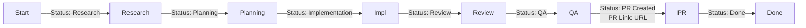

# Ticket-to-PR Pipeline: Implementation Plan

## Overview

A waterfall pipeline with human checkpoints to transform a Notion ticket into an open, CI-passing PR on ComfyUI_frontend.

---

## Part 1: Skills to Build

### 1.1 Core Pipeline Skills

| Skill | Purpose | Dependencies |
|-------|---------|--------------|
| `ticket-intake` | Parse Notion URL, extract ticket data, initialize pipeline | Notion MCP |
| `research-orchestrator` | Generate research plan, dispatch subagents, compile report | dispatching-parallel-agents |
| `plan-generator` | Create high-level plan from research, iterate with human | writing-plans |
| `plan-to-tasks` | Convert plan to implementation tasks | writing-plans |
| `pr-split-advisor` | Assess and recommend PR splitting strategy | splitting-prs, worktree-utils |
| `tdd-assessor` | Evaluate if TDD is beneficial, setup test-first approach | test-driven-development |
| `quality-gates-runner` | Run all linting/type/test checks via subagents | subagent-driven-development |
| `review-orchestrator` | Dispatch review subagents, compile & triage comments | requesting-code-review |
| `visual-verifier` | Optional Playwright/Chrome DevTools verification | webapp-testing |
| `final-qa-launcher` | Start dev server, print QA checklist | tmux |
| `pr-creator` | Generate description, labels, submit PR | (gh CLI) |
| `ci-checker` | Check CI status, guide fixes | (gh CLI) |
| `pipeline-tracker` | Sync status to Notion dashboard | Notion MCP |

### 1.2 Research Subagent Prompts

Each research area needs a specialized prompt template:

```
/pipeline-docs/research-prompts/
├── slack-thread.md          # Extract context from Slack discussions
├── notion-related.md        # Find related Notion pages/tasks
├── git-history.md           # Commits, blame, affected files
├── github-prs-issues.md     # Related PRs and issues
├── codebase-analysis.md     # Affected files, patterns, architecture
└── external-research.md     # Best practices, libraries, patterns
```

### 1.3 Review Subagent Prompts

```
/pipeline-docs/review-prompts/
├── coderabbit-review.md     # Run CodeRabbit CLI
├── agent-code-review.md     # Standard agent review
└── pattern-review.md        # Check against codebase patterns
```

---

## Part 2: MCP Integrations

### 2.1 Required MCPs

| MCP | Purpose | Status |
|-----|---------|--------|
| **Notion MCP** | Read tickets, update status, add PR links | Needs setup |
| **Slack MCP** | Read linked Slack threads | Needs research |
| **Chrome DevTools MCP** | Visual verification | Available |
| **Playwright MCP** | E2E testing | Needs research |
| **Context7 / DeepWiki** | ComfyUI documentation | Available |

### 2.2 Notion MCP Setup

```yaml
# Required capabilities:
- Read page content by URL
- Query databases (find related tasks)
- Update page properties (Status, PR Link, Assignee)
- List database entries for dashboard

# API Key location: TBD (env var or secrets manager)
```

### 2.3 Slack MCP Research Needed

- [ ] Identify best Slack MCP implementation
- [ ] Determine required OAuth scopes
- [ ] Test reading thread by URL
- [ ] Handle private vs public channels

---

## Part 3: Scripts & Utilities

### 3.1 Research Helper Scripts

```
/pipeline-docs/scripts/
├── git-search-commits.sh    # Search commits by keyword/author/file
├── git-blame-summary.sh     # Summarize file history
├── gh-search-prs.sh         # Search PRs with filters
├── gh-search-issues.sh      # Search issues with filters
└── compile-research.sh      # Combine subagent outputs
```

### 3.2 Quality Gate Scripts

```bash
# Run all quality gates in parallel via subagents
pnpm lint
pnpm format:check
pnpm typecheck
pnpm knip
pnpm test:unit
pnpm stylelint
```

### 3.3 PR Creation Script

```bash
# Template for PR creation
gh pr create \
  --title "$TITLE" \
  --body-file "$BODY_FILE" \
  --label "area:$AREA" \
  --assignee "@me"
```

---

## Part 4: Research Sources Registry

### 4.1 Context Snippets (Pre-compiled)

| Source | When to Use | Snippet/Instruction |
|--------|-------------|---------------------|
| **ComfyUI docs** | Node behavior, API | Use context7 or deepwiki MCP |
| **embedded-docs repo** | Individual node docs | Read from `comfyui_embedded_docs/` |
| **Vue 3 docs** | Component patterns | `https://vuejs.org/api/` |
| **Tailwind docs** | Styling | `https://tailwindcss.com/docs/` |
| **VueUse** | Composables | `https://vueuse.org/` |
| **Reka UI** | UI components | `https://reka-ui.com/` |
| **Frontend AGENTS.md** | Coding standards | Local file |
| **Testing guides** | Test patterns | `ComfyUI_frontend/docs/testing/*.md` |

### 4.2 Research Targets Checklist

For each ticket, consider researching:

```markdown
## Mandatory
- [ ] Full ticket description and acceptance criteria
- [ ] Linked Slack thread (if exists)
- [ ] Affected files (identify from ticket description)
- [ ] Recent commits touching affected files (90 days)
- [ ] Open PRs touching same areas
- [ ] Related closed PRs for patterns

## Conditional
- [ ] Notion related tasks (if linked)
- [ ] GitHub issues with similar keywords
- [ ] Author history on affected files
- [ ] External best practices (if new pattern)
- [ ] Library documentation (if new dependency)
```

---

## Part 5: Dashboard & Tracking

### 5.1 Notion Dashboard Schema

```yaml
Database: "Pipeline Tracker"
Properties:
  - Ticket: URL (link to original ticket)
  - Status: Select [Not Started, Research, Planning, Implementation, Review, QA, PR Created, Done, Blocked]
  - PR Link: URL
  - Assignee: Person
  - Branch: Text
  - Current Step: Text
  - Blockers: Text
  - Started: Date
  - Last Updated: Date (auto)
  - Research Doc: URL
  - Plan Doc: URL
```

### 5.2 Status Sync Points



### 5.3 Local Fallback

If Notion integration is slow to setup, use local markdown:

```
/temp/pipeline-runs/
├── {ticket-id}/
│   ├── status.json           # Current status
│   ├── research-report.md    # Research output
│   ├── plan.md               # High-level plan
│   ├── tasks.md              # Implementation tasks
│   ├── review-comments.md    # Review output
│   └── qa-checklist.md       # QA items
```

---

## Part 6: Skill Detailed Specifications

### 6.1 `ticket-intake` Skill

**Trigger:** User provides Notion ticket URL

**Steps:**
1. Parse Notion URL to extract page ID
2. Use Notion MCP to fetch page content
3. Extract: title, description, acceptance criteria, linked Slack, linked tasks
4. Create pipeline run directory: `/temp/pipeline-runs/{ticket-id}/`
5. Initialize `status.json` with "Research" status
6. Update Notion: Status → "In Progress", Assignee → (current user)
7. Return structured ticket data

**Output:** Ticket summary + prompt for research phase

### 6.2 `research-orchestrator` Skill

**Trigger:** After ticket-intake completes

**Steps:**
1. Analyze ticket to determine relevant research areas
2. Generate research plan (subset of all possible sources)
3. Create subagent prompts for each area
4. Dispatch all subagents in parallel
5. Collect results as they complete
6. Compile unified research report
7. Save to `/temp/pipeline-runs/{ticket-id}/research-report.md`
8. Present to human for review

**Subagent Dispatch Pattern:**
```typescript
// Pseudo-code
const tasks = [
  { name: 'slack', prompt: slackPrompt, skip: !hasSlackLink },
  { name: 'notion', prompt: notionPrompt, skip: !hasRelatedTasks },
  { name: 'git', prompt: gitPrompt },
  { name: 'prs', prompt: prPrompt },
  { name: 'codebase', prompt: codebasePrompt },
  { name: 'external', prompt: externalPrompt, skip: !needsExternalResearch }
]
await Promise.all(tasks.filter(t => !t.skip).map(dispatchSubagent))
```

### 6.3 `plan-generator` Skill

**Trigger:** Human approves research report

**Steps:**
1. Load research report
2. Generate high-level approach with:
   - Goal summary
   - Proposed approach
   - Pivot points (where alternative decisions exist)
   - Risks and mitigations
   - Considerations
   - Dependencies
3. Save to `/temp/pipeline-runs/{ticket-id}/plan.md`
4. Present to human for iteration
5. Loop until approved

### 6.4 `pr-split-advisor` Skill

**Trigger:** After implementation tasks defined

**Steps:**
1. Analyze scope of changes
2. Estimate lines of code
3. Identify layer boundaries (DB, API, UI)
4. Present options:
   - **Vertical slices:** If changes are independent
   - **Stacked PRs:** If changes have dependencies
   - **Single PR:** If < 200 LoC or highly coupled
5. Based on choice:
   - Vertical: Use worktree-utils to create worktrees
   - Stacked: Setup Graphite stack
   - Single: Continue normally
6. Update plan to reflect split strategy

### 6.5 `quality-gates-runner` Skill

**Trigger:** After code changes made

**Steps:**
1. Dispatch subagents for each quality check (to avoid context flooding):
   - Subagent 1: `pnpm lint`
   - Subagent 2: `pnpm format:check`
   - Subagent 3: `pnpm typecheck`
   - Subagent 4: `pnpm knip`
   - Subagent 5: `pnpm test:unit`
2. Collect pass/fail status
3. If any fail, return specific errors
4. If all pass, proceed to review

### 6.6 `review-orchestrator` Skill

**Trigger:** Quality gates pass

**Steps:**
1. Dispatch review subagents:
   - **CodeRabbit CLI:** Run `coderabbit review` (if available)
   - **Agent Review:** Standard code review pass
   - **Pattern Review:** Check against AGENTS.md patterns
2. Compile all review comments
3. Dedupe and categorize:
   - Critical (must fix)
   - Suggested (should fix)
   - Nitpick (optional)
   - Conflicting (needs resolution)
4. Save to `/temp/pipeline-runs/{ticket-id}/review-comments.md`
5. Present itemized list to human
6. Human marks each as: Implement / Skip / Adjust
7. Return to implementation for selected items

### 6.7 `final-qa-launcher` Skill

**Trigger:** Review complete, code ready

**Steps:**
1. Use tmux to start dev server:
   ```bash
   tmux new-window -n "dev-server" -d
   tmux send-keys -t "dev-server" "cd ComfyUI_frontend && pnpm dev:cloud" C-m
   ```
2. Wait for server ready
3. Print URL: `http://localhost:5173`
4. Generate QA checklist from acceptance criteria
5. Print checklist for human manual verification
6. Wait for human approval

### 6.8 `pr-creator` Skill

**Trigger:** Human approves final QA

**Steps:**
1. Check for conflicts with main
2. Generate PR description from template:
   ```markdown
   ## Summary
   {one sentence from ticket}
   
   ## Changes
   - **What**: {changes made}
   - **Breaking**: {if any}
   
   ## Review Focus
   {key decisions or edge cases}
   
   Fixes #{issue_number}
   ```
3. Determine area labels from files changed
4. Create PR: `gh pr create ...`
5. Print PR link
6. Update Notion: add PR link, status → "In Review"

---

## Part 7: Pre-Compiled Research Snippets

### 7.1 ComfyUI Research Snippet

```markdown
## For ComfyUI Backend/API questions:
- Use context7 or deepwiki MCP: `deepwiki.com/Comfy-Org/ComfyUI`
- Check embedded-docs repo for node documentation
- Reference: https://docs.comfy.org

## For ComfyUI Frontend questions:
- Use deepwiki: `deepwiki.com/Comfy-Org/ComfyUI_frontend`
- Check local AGENTS.md for conventions
```

### 7.2 Testing Research Snippet

```markdown
## For testing patterns:
1. Read `ComfyUI_frontend/docs/testing/README.md`
2. Component tests: `docs/testing/component-testing.md`
3. Unit tests: `docs/testing/unit-testing.md`
4. Store tests: `docs/testing/store-testing.md`
5. Look at similar test files: `find src -name "*.test.ts"`
```

### 7.3 Git History Research Snippet

```bash
# Find commits touching specific files
git log --oneline --since="90 days ago" -- path/to/file

# Find commits by keyword
git log --oneline --all --grep="keyword"

# Blame summary
git blame --line-porcelain path/to/file | grep "^author " | sort | uniq -c | sort -rn

# Find PRs that touched a file
gh pr list --state merged --search "path/to/file"
```

---

## Part 8: Next Steps

### Immediate (This Session)
1. [x] Create pipeline diagram
2. [x] Create this implementation plan
3. [ ] Research Notion MCP options
4. [ ] Research Slack MCP options
5. [ ] Create research prompt templates

### Short-Term (Next Sessions)
1. [ ] Build `ticket-intake` skill
2. [ ] Build `research-orchestrator` skill
3. [ ] Create subagent prompt templates
4. [ ] Setup Notion API integration
5. [ ] Test with a real ticket

### Medium-Term
1. [ ] Build remaining skills
2. [ ] Setup dashboard in Notion
3. [ ] Create helper scripts
4. [ ] Document the pipeline for others
5. [ ] Refine based on real usage

---

## Appendix: Research Findings

### Notion MCP ✅ READY

**Official Notion MCP is available!** Hosted at `https://mcp.notion.com/mcp`

**Setup for Amp/Claude Code:**
```bash
claude mcp add --transport http notion https://mcp.notion.com/mcp
```

Then authenticate via `/mcp` command and OAuth flow.

**Supported Tools:**
- `notion-search` - Search across workspace
- `notion-fetch` - Get page content
- Create/update pages
- Query/update databases
- Create database rows

**Rate Limits:** 180 requests/min, 30 searches/min

**Alternative:** For more control, use the community Notion MCP server with local API key.

---

### Slack MCP ⚠️ LIMITED ACCESS

**Status:** Slack MCP is being rolled out to select partners only (Claude.ai, Perplexity).

**Available Features (when accessible):**
- Search messages and files
- Read channels and threads
- Send messages
- Manage canvases
- Fetch user profiles

**Workarounds:**
1. **Composio MCP** - Third-party integration that provides Slack access
2. **Manual Slack App** - Create custom Slack app with OAuth scopes:
   - `channels:history`, `channels:read`, `chat:write`, `search:read.public`
3. **Copy-paste fallback** - Human copies Slack thread content to research doc

**Recommendation:** Start with manual copy-paste for MVP, add Composio MCP later.

---

### CodeRabbit CLI ✅ READY

**Installation:**
```bash
curl -fsSL https://cli.coderabbit.ai/install.sh | sh
```

**Usage for AI Agents:**
```bash
# Prompt-only mode for agent consumption
coderabbit --prompt-only

# Review uncommitted changes
coderabbit --prompt-only --type uncommitted

# With specific base branch
coderabbit --prompt-only --base develop
```

**Rate Limits:**
- Free: 2 reviews/hour
- Pro: 8 reviews/hour

**Features:**
- Detects claude.md, cursor rules, coding agent files
- One-click fixes
- Context-aware reviews (paid)
- Integrates with Claude Code, Codex, Cursor, etc.

---

### Graphite CLI

**Check if installed:**
```bash
which gt || npm install -g @withgraphite/graphite-cli
```

**Stacking workflow:**
```bash
gt create    # Create stacked PR
gt submit    # Submit stack
gt sync      # Sync after merges
```

---

### Summary of Tool Readiness

| Tool | Status | Action |
|------|--------|--------|
| Notion MCP | ✅ Ready | Setup OAuth, test tools |
| Slack MCP | ⚠️ Limited | Use manual copy-paste for MVP |
| CodeRabbit CLI | ✅ Ready | Install and test |
| Graphite CLI | ✅ Available | Install if needed |
| Chrome DevTools MCP | ✅ Ready | Already available |
| worktree-utils | ✅ Ready | Already installed |
