# Ticket-to-PR Pipeline Diagram

## High-Level Flow

```mermaid
flowchart TB
    subgraph ENTRY["🎫 ENTRYPOINT"]
        A[Notion Ticket URL] --> B[Parse & Extract Ticket Info]
    end

    subgraph RESEARCH["🔍 RESEARCH PHASE"]
        B --> C{Research Plan Generator}
        C --> D1[Subagent: Slack Thread]
        C --> D2[Subagent: Notion Related]
        C --> D3[Subagent: Git History]
        C --> D4[Subagent: PRs & Issues]
        C --> D5[Subagent: Codebase Analysis]
        C --> D6[Subagent: External Research]
        D1 & D2 & D3 & D4 & D5 & D6 --> E[Compile Research Report]
    end

    subgraph PLANNING["📋 PLANNING PHASE"]
        E --> F[Human Review Research]
        F --> G[Generate High-Level Plan]
        G --> H[Human Review Plan]
        H --> I[Convert to Implementation Tasks]
        I --> J[Human Review Tasks]
    end

    subgraph SPLITTING["✂️ PR SPLITTING DECISION"]
        J --> K{PR Split Assessment}
        K -->|Vertical Slices| L1[Setup Independent Worktrees]
        K -->|Stacked PRs| L2[Setup Graphite Stack]
        K -->|Single PR| L3[Continue as Single]
        L1 & L2 & L3 --> M[Adjust Plan for Split Strategy]
    end

    subgraph TDD["🧪 TDD ASSESSMENT"]
        M --> N{TDD Beneficial?}
        N -->|Yes| O[Research Testing Patterns]
        N -->|No| P[Skip TDD]
        O --> Q[Update Plan with TDD Approach]
        Q --> R[Verify Tests Fail First]
        P --> R
    end

    subgraph IMPLEMENTATION["💻 IMPLEMENTATION"]
        R --> S[Execute Implementation Plan]
        S --> T[Run Quality Gates]
        T --> |Pass| U[Proceed to Review]
        T --> |Fail| S
    end

    subgraph REVIEW["👀 REVIEW PHASE"]
        U --> V1[Subagent: CodeRabbit CLI]
        U --> V2[Subagent: Agent Review]
        U --> V3[Subagent: Pattern Review]
        V1 & V2 & V3 --> W[Compile Review Comments]
        W --> X[Human Triage Comments]
        X --> Y{Implement Changes?}
        Y -->|Yes| S
        Y -->|No| Z[Continue]
    end

    subgraph VISUAL["🖥️ VISUAL VERIFICATION"]
        Z --> AA{Visual Test Needed?}
        AA -->|Yes| AB[Chrome DevTools + Playwright]
        AA -->|No| AC[Skip]
        AB --> AC
    end

    subgraph FINAL["✅ FINAL REVIEW"]
        AC --> AD[Start Dev Server in tmux]
        AD --> AE[Print QA Checklist]
        AE --> AF[Human Manual Verification]
        AF --> AG{Approved?}
        AG -->|No| S
        AG -->|Yes| AH[Create PR]
    end

    subgraph PR["🚀 PR CREATION"]
        AH --> AI[Generate PR Description]
        AI --> AJ[Add area:* Labels]
        AJ --> AK[Submit PR]
        AK --> AL[Print PR Link]
        AL --> AM[Human: Wait for CI]
        AM --> AN{CI Passed?}
        AN -->|No| AO[Fix CI Issues]
        AO --> AN
        AN -->|Yes| AP[✨ Done]
    end

    subgraph TRACKING["📊 DASHBOARD (Parallel)"]
        B -.-> DA[(Notion: Status → In Progress)]
        AH -.-> DB[(Notion: Add PR Link)]
        AP -.-> DC[(Notion: Status → Done)]
    end
```

## Phase Details

### Phase 1: Research (Parallel Subagents)

### Phase 2: Planning Iterations

### Phase 3: Implementation Loop

## Quality Gates

## Human Checkpoints

| Checkpoint      | Description                     | Decision Options                 |
| --------------- | ------------------------------- | -------------------------------- |
| Research Review | Review compiled research report | Continue / Request more research |
| Plan Review     | Review high-level approach      | Approve / Request changes        |
| Task Review     | Review implementation tasks     | Approve / Adjust scope           |
| Split Decision  | Choose PR splitting strategy    | Vertical / Stacked / Single      |
| TDD Decision    | Decide if TDD beneficial        | Yes / No                         |
| Review Triage   | Process code review comments    | Implement / Skip / Adjust        |
| Visual Test     | Optional browser verification   | Invoke / Skip                    |
| Final QA        | Manual verification in browser  | Approve / Reject                 |
| CI Wait         | Wait for GitHub CI              | "Check CI" when ready            |
