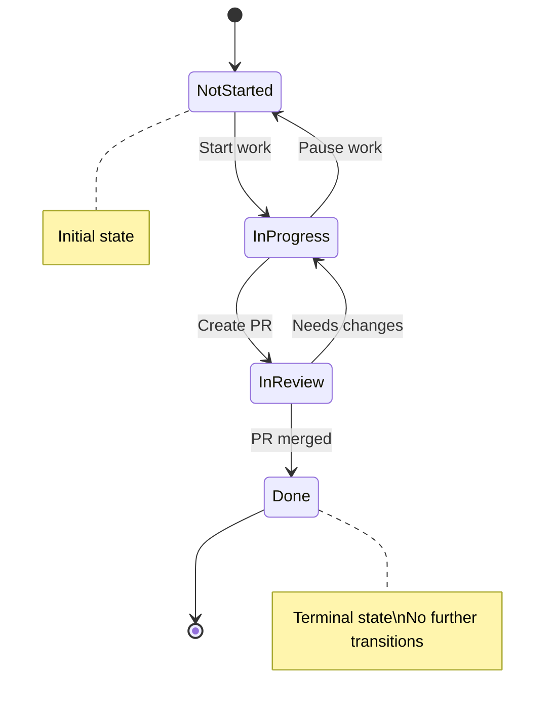

# Notion Write Safety

Reference document for skills that write to Notion. All Notion writes MUST follow these rules.

## Allowed Fields (Whitelist)

Only these fields may be written:

| Field | Type | Allowed Values |
|-------|------|----------------|
| Status | Select | `Not Started`, `In Progress`, `In Review`, `Done` |
| GitHub PR | URL | Valid GitHub PR URL matching `^https://github\.com/[^/]+/[^/]+/pull/\d+$` |
| Assignee | Person | Assign only, never unassign existing |

**All other fields are READ-ONLY.**

## Validation Rules

Before any Notion write, validate:

### 1. Page ID Verification

```javascript
// Page ID must exist in ticket.json
const ticket = JSON.parse(fs.readFileSync('ticket.json'));
if (!ticket.pageId && !ticket.id) {
  throw new Error('No valid page ID in ticket.json');
}
```

### 2. Status Transition Validation

Only these transitions are allowed:

| From | Allowed To |
|------|------------|
| Not Started | In Progress |
| In Progress | In Review, Not Started |
| In Review | Done, In Progress |
| Done | (no further transitions) |

```javascript
const VALID_TRANSITIONS = {
  'Not Started': ['In Progress'],
  'In Progress': ['In Review', 'Not Started'],
  'In Review': ['Done', 'In Progress'],
  'Done': []
};

function isValidTransition(from, to) {
  return VALID_TRANSITIONS[from]?.includes(to) ?? false;
}
```

### 3. PR URL Validation

```javascript
const PR_URL_PATTERN = /^https:\/\/github\.com\/[^/]+\/[^/]+\/pull\/\d+$/;

function isValidPrUrl(url) {
  return PR_URL_PATTERN.test(url);
}
```

### 4. Logging Requirement

Every write attempt MUST be logged with timestamp.

## Write Log Schema

Add to `status.json`:

```json
{
  "notionWrites": [
    {
      "field": "Status",
      "value": "In Progress",
      "previousValue": "Not Started",
      "at": "2024-01-15T10:30:00Z",
      "skill": "ticket-intake",
      "success": true
    },
    {
      "field": "GitHub PR",
      "value": "https://github.com/Comfy-Org/ComfyUI_frontend/pull/123",
      "previousValue": null,
      "at": "2024-01-15T14:30:00Z",
      "skill": "pr-creator",
      "success": true
    }
  ]
}
```

### Log Entry Fields

| Field | Type | Required | Description |
|-------|------|----------|-------------|
| field | string | Yes | Field being written |
| value | string | Yes | New value |
| previousValue | string\|null | Yes | Previous value (null if unknown) |
| at | ISO8601 | Yes | Timestamp of attempt |
| skill | string | Yes | Skill name performing write |
| success | boolean | Yes | Whether write succeeded |
| error | string | No | Error message if failed |

## Pre-Write Checklist

**Copy this snippet into skills that write to Notion:**

```markdown
### Notion Write Safety Check

Before writing to Notion:

1. [ ] Field is in whitelist (Status, GitHub PR, Assignee only)
2. [ ] Value format validated:
   - Status: one of "Not Started", "In Progress", "In Review", "Done"
   - GitHub PR: matches `^https://github\.com/[^/]+/[^/]+/pull/\d+$`
   - Assignee: assign action only
3. [ ] Status transition is valid (see transition diagram)
4. [ ] Page ID exists in ticket.json
5. [ ] Log entry prepared for status.json
6. [ ] Failure handling ready (continue pipeline, don't block)

After write:
- [ ] Update notionWrites array in status.json
- [ ] Set success: true/false
- [ ] Include error message if failed
```

## State Transition Diagram



## Implementation Examples

### Logging a Write (Bash/jq)

```bash
# Add write log entry to status.json
log_notion_write() {
  local field="$1"
  local value="$2"
  local prev_value="$3"
  local skill="$4"
  local success="$5"
  local error="${6:-null}"
  local timestamp=$(date -u +"%Y-%m-%dT%H:%M:%SZ")
  
  jq --arg f "$field" \
     --arg v "$value" \
     --arg pv "$prev_value" \
     --arg t "$timestamp" \
     --arg s "$skill" \
     --argjson ok "$success" \
     --arg e "$error" \
     '.notionWrites += [{
       field: $f,
       value: $v,
       previousValue: (if $pv == "null" then null else $pv end),
       at: $t,
       skill: $s,
       success: $ok,
       error: (if $e == "null" then null else $e end)
     }]' status.json > tmp.json && mv tmp.json status.json
}

# Usage
log_notion_write "Status" "In Progress" "Not Started" "ticket-intake" true
```

### Safe Status Update Flow

```
1. Read current status from ticket.json
2. Validate transition is allowed
3. Prepare log entry
4. Attempt Notion update via MCP
5. Log result (success or failure)
6. Continue pipeline regardless of result
```

## Error Handling

Notion write failures should NOT block the pipeline:

```
⚠️ Notion update failed: {error}

Continuing with pipeline. Status will be synced later via pipeline-tracker.

Logged to: status.json → notionWrites
```

## Safety Reference

This document: `/home/cbyrne/repos/ticket-to-pr-pipeline/docs/notion-write-safety.md`

Skills using this reference:
- `ticket-intake` - Updates Status to "In Progress"
- `pr-creator` - Updates Status to "In Review", adds GitHub PR URL
- `ci-checker` - May update Status to "Done"
- `pipeline-tracker` - Syncs all status updates
