# Pipeline State Management Architecture

## Overview

The pipeline uses a **two-layer state system**:

| Layer | Purpose | Scope |
|-------|---------|-------|
| **Notion** | Source of truth for ticket lifecycle | High-level status visible to team |
| **Local** | Detailed phase tracking + artifacts | `runs/{ticket-id}/` per pipeline run |

Notion is updated at **3 critical moments only**. Local state tracks the 10 internal phases.

---

## Architecture Diagram

```mermaid
flowchart TB
    subgraph NOTION["☁️ NOTION (Source of Truth)"]
        direction TB
        NT[("Ticket Database")]
        NF["Fields:<br/>• Status (select)<br/>• GitHub PR (url)<br/>• Assignee (person)"]
        NT --- NF
    end

    subgraph LOCAL["💾 LOCAL STATE (runs/{ticket-id}/)"]
        direction TB
        SJ["status.json<br/>───────────<br/>• phase<br/>• started_at<br/>• updated_at<br/>• error"]
        TJ["ticket.json<br/>───────────<br/>• id, title<br/>• notion_url<br/>• slack_url<br/>• acceptance_criteria"]
        ARTS["Artifacts<br/>───────────<br/>• research-report.md<br/>• plan.md<br/>• tasks.md<br/>• review-comments.md"]
        SJ ~~~ TJ ~~~ ARTS
    end

    subgraph SKILLS["🔧 SKILLS (Write Responsibility)"]
        direction LR
        TI["ticket-intake"]
        PC["pr-creator"]
        CC["ci-checker"]
        RO["research-orchestrator"]
        PG["plan-generator"]
        RV["review-orchestrator"]
    end

    TI -->|"Status → In Progress<br/>Assignee → Christian"| NT
    PC -->|"Status → In Review<br/>GitHub PR → URL"| NT
    CC -->|"Status → Done"| NT

    TI -->|"Initialize"| SJ
    TI -->|"Save ticket data"| TJ
    RO -->|"phase: research"| SJ
    RO -->|"research-report.md"| ARTS
    PG -->|"phase: planning"| SJ
    PG -->|"plan.md, tasks.md"| ARTS
    RV -->|"phase: review"| SJ
    RV -->|"review-comments.md"| ARTS

    NT -.->|"Read only"| TI
    
    style NOTION fill:#f5f5dc,stroke:#333
    style LOCAL fill:#e6f3ff,stroke:#333
    style SKILLS fill:#f0fff0,stroke:#333
```



---

## Notion Writes

Only **3 moments** trigger Notion writes. Only **3 fields** are ever touched.

### Write Points

```mermaid
timeline
    title Notion Write Timeline
    
    section Intake
        ticket-intake : Status → In Progress
                      : Assignee → Christian Byrne
    
    section PR Created  
        pr-creator : Status → In Review
                   : GitHub PR → https://github.com/.../pull/123
    
    section CI Passes
        ci-checker : Status → Done
```



### Fields Modified

| Field | Type | Values | Modified By |
|-------|------|--------|-------------|
| **Status** | Select | `Not Started` → `In Progress` → `In Review` → `Done` | ticket-intake, pr-creator, ci-checker |
| **GitHub PR** | URL | PR link | pr-creator |
| **Assignee** | Person | Christian Byrne | ticket-intake |

### What's Never Touched

- ❌ Title
- ❌ Description / Content
- ❌ Acceptance Criteria
- ❌ Linked Tasks
- ❌ Tags / Labels
- ❌ Due Date
- ❌ Priority
- ❌ Any rich text content

---

## Lifecycle Sequence Diagram

```mermaid
sequenceDiagram
    autonumber
    participant U as User
    participant TI as ticket-intake
    participant N as Notion
    participant L as Local State
    participant RO as research-orchestrator
    participant PG as plan-generator
    participant QG as quality-gates
    participant RV as review-orchestrator
    participant PC as pr-creator
    participant CI as ci-checker

    U->>TI: Provide Notion URL
    
    rect rgb(255, 235, 205)
        Note over TI,N: 🔔 NOTION WRITE #1
        TI->>N: Status → In Progress
        TI->>N: Assignee → Christian Byrne
    end
    
    TI->>L: Create runs/{id}/
    TI->>L: Write ticket.json
    TI->>L: Write status.json (phase: intake)
    
    TI->>RO: Hand off
    RO->>L: Update phase: research
    RO->>L: Write research-report.md
    RO->>U: Present report
    
    U->>PG: Approve research
    PG->>L: Update phase: planning
    PG->>L: Write plan.md
    PG->>U: Present plan
    
    U->>PG: Approve plan
    PG->>L: Update phase: implementation
    PG->>L: Write tasks.md
    
    loop Implementation Cycle
        PG->>QG: Run quality gates
        QG->>L: Update phase: quality-check
        alt Gates Pass
            QG->>RV: Proceed to review
        else Gates Fail
            QG->>L: Update phase: implementation
        end
    end
    
    RV->>L: Update phase: review
    RV->>L: Write review-comments.md
    RV->>U: Present review
    
    U->>RV: Approve changes
    RV->>L: Update phase: qa
    RV->>U: QA checklist
    
    U->>PC: Approve QA
    
    rect rgb(255, 235, 205)
        Note over PC,N: 🔔 NOTION WRITE #2
        PC->>N: Status → In Review
        PC->>N: GitHub PR → URL
    end
    
    PC->>L: Update phase: pr-created
    PC->>U: PR link
    
    U->>CI: Check CI (after ~30 min)
    CI->>L: Update phase: ci-check
    
    alt CI Passes
        rect rgb(255, 235, 205)
            Note over CI,N: 🔔 NOTION WRITE #3
            CI->>N: Status → Done
        end
        CI->>L: Update phase: done
        CI->>U: ✨ Complete
    else CI Fails
        CI->>L: Update phase: ci-fix
        CI->>U: Fix instructions
    end
```



---

## Local State Schema

### Directory Structure

```
runs/
└── {ticket-id}/
    ├── status.json           # Pipeline phase tracking
    ├── ticket.json           # Original ticket data
    ├── research-report.md    # Research subagent output
    ├── plan.md               # High-level plan
    ├── tasks.md              # Implementation tasks
    ├── review-comments.md    # Compiled review feedback
    └── qa-checklist.md       # Final QA items
```

### status.json

```jsonc
{
  "ticket_id": "abc123",
  "phase": "implementation",      // Current local phase
  "notion_status": "In Progress", // Last known Notion status
  "started_at": "2025-01-28T10:30:00Z",
  "updated_at": "2025-01-28T14:22:00Z",
  "pr_url": null,                 // Set when PR created
  "branch": "feature/abc123-fix-bug",
  "error": null,                  // Last error if any
  "history": [                    // Phase transitions
    {"phase": "intake", "at": "2025-01-28T10:30:00Z"},
    {"phase": "research", "at": "2025-01-28T10:31:00Z"},
    {"phase": "planning", "at": "2025-01-28T11:15:00Z"},
    {"phase": "implementation", "at": "2025-01-28T12:00:00Z"}
  ]
}
```

### ticket.json

```jsonc
{
  "id": "abc123",
  "notion_url": "https://notion.so/...",
  "notion_page_id": "abc123-def456-...",
  "title": "Fix button alignment in sidebar",
  "description": "The buttons in the sidebar...",
  "acceptance_criteria": [
    "Buttons align vertically",
    "Spacing matches design spec"
  ],
  "slack_url": "https://slack.com/archives/...",
  "related_tasks": ["def456", "ghi789"],
  "extracted_at": "2025-01-28T10:30:00Z"
}
```

---

## Phase Mapping Table


### Mapping Table

| Local Phase | Notion Status | Transition Trigger |
|-------------|---------------|-------------------|
| `intake` | In Progress | ticket-intake starts |
| `research` | In Progress | — |
| `planning` | In Progress | — |
| `implementation` | In Progress | — |
| `quality-check` | In Progress | — |
| `review` | In Progress | — |
| `qa` | In Progress | — |
| `pr-created` | **In Review** | PR submitted |
| `ci-check` | In Review | — |
| `ci-fix` | In Review | — |
| `done` | **Done** | CI passes |

---

## Safety Guarantees

### What We Never Do

```mermaid
flowchart TB
    subgraph SAFE["✅ SAFE (We Do This)"]
        S1["Update Status select field"]
        S2["Set GitHub PR URL field"]
        S3["Set Assignee person field"]
    end

    subgraph UNSAFE["❌ UNSAFE (We Never Do This)"]
        U1["Edit title"]
        U2["Edit description/content"]
        U3["Modify acceptance criteria"]
        U4["Delete anything"]
        U5["Touch linked pages"]
        U6["Modify tags/labels"]
    end

    style SAFE fill:#90EE90
    style UNSAFE fill:#FFB6C1
```



### Validation Before Writes

```mermaid
flowchart LR
    A[Write Request] --> B{Validate Field}
    B -->|Status| C{Value in allowed set?}
    B -->|GitHub PR| D{Valid URL format?}
    B -->|Assignee| E{Valid user ID?}
    B -->|Other Field| F[❌ REJECT]
    
    C -->|Yes| G[✅ Execute]
    C -->|No| F
    D -->|Yes| G
    D -->|No| F
    E -->|Yes| G
    E -->|No| F
```



### Allowed Status Values

```typescript
const ALLOWED_STATUSES = [
  "Not Started",
  "In Progress", 
  "In Review",
  "Done"
] as const;

const ALLOWED_TRANSITIONS = {
  "Not Started": ["In Progress"],
  "In Progress": ["In Review"],
  "In Review": ["Done", "In Progress"], // Can revert if CI fails badly
  "Done": [] // Terminal state
};
```

### Why Rollback Isn't Needed

| Scenario | Recovery |
|----------|----------|
| Status set incorrectly | Human can fix in Notion UI (30 seconds) |
| PR URL wrong | Update with correct URL |
| Assignee wrong | Human can reassign |
| Pipeline crashes mid-run | Resume from local state; Notion status unchanged |

All fields are **recoverable** via Notion UI. No data loss is possible.

---

## pipeline-tracker Sync

The `pipeline-tracker` skill provides bulk status sync between local and Notion.

### Sync Flow

```mermaid
sequenceDiagram
    participant U as User
    participant PT as pipeline-tracker
    participant L as Local (runs/)
    participant N as Notion

    U->>PT: Sync status
    
    PT->>L: Scan all runs/*/status.json
    
    loop Each Active Run
        PT->>L: Read status.json
        PT->>N: Query ticket status
        
        alt Local ahead of Notion
            Note over PT: Local: pr-created<br/>Notion: In Progress
            PT->>N: Update Status → In Review
        else Notion ahead of Local
            Note over PT: Human manually closed
            PT->>L: Update phase: done
        else In Sync
            Note over PT: No action needed
        end
    end
    
    PT->>U: Sync report
```



### Sync Commands

```bash
# Sync all active pipeline runs
pipeline-tracker sync

# Sync specific ticket
pipeline-tracker sync --ticket abc123

# Dry run (show what would change)
pipeline-tracker sync --dry-run

# Force Notion to match local
pipeline-tracker sync --force-local

# Force local to match Notion
pipeline-tracker sync --force-notion
```

### Sync Report Format

```
Pipeline Status Sync Report
===========================

✅ abc123: In sync (In Progress)
⬆️ def456: Updated Notion (In Progress → In Review)
⬇️ ghi789: Updated local (review → done) [manual close]
⚠️ jkl012: Conflict - manual resolution needed

Summary: 4 runs, 2 synced, 1 conflict
```

---

## Quick Reference

### Notion Write Checklist

- [ ] **Intake**: `ticket-intake` → Status: In Progress, Assignee: set
- [ ] **PR Created**: `pr-creator` → Status: In Review, GitHub PR: URL
- [ ] **Done**: `ci-checker` → Status: Done

### Local Phase Progression

```
intake → research → planning → implementation → quality-check → review → qa → pr-created → ci-check → done
                          ↑___________________________________________|
                                    (loop on failures)
```

### File Ownership

| File | Created By | Updated By |
|------|------------|------------|
| status.json | ticket-intake | All skills |
| ticket.json | ticket-intake | Never modified |
| research-report.md | research-orchestrator | — |
| plan.md | plan-generator | plan-generator |
| tasks.md | plan-generator | — |
| review-comments.md | review-orchestrator | — |
| qa-checklist.md | final-qa-launcher | — |
